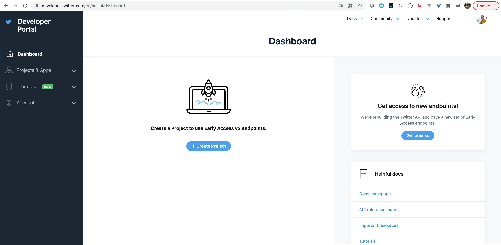
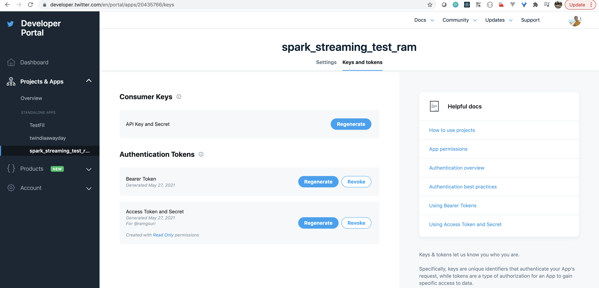
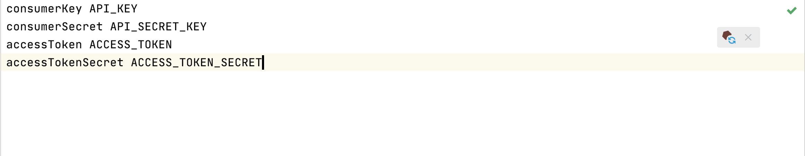

# Spark Streaming ~ Analysing Live Tweets 
This Repository is for folks who want to learn streaming with spark and scala.
This includes streaming live tweets and popular hashtags 
and you can change the filters in code if you want to do analysis 
relevant to any other topic.

## Setup Twitter Developer Account

1. Go to https://developer.twitter.com/    

2. Click on Developer Portal

3. Create a Project / App Id  

4. Get API Secret and Token

5. Save the credentials in twitter.txt file which will be 
used in the program.

 
